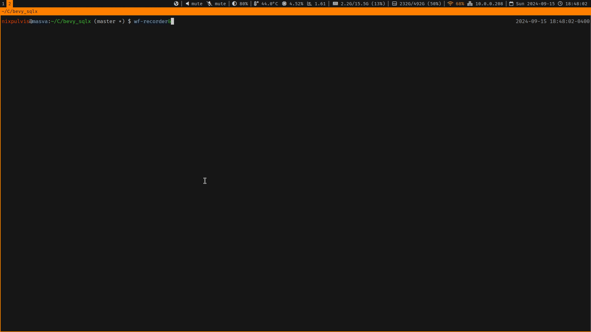

# Bevy SQLx
-----

Bevy SQLx is a database plugin for Bevy's ECS which allows for SQL queries to
be performed and data entities to be spawned.


### Usage

```sh
DATABASE_URL="sqlite:db/sqlite.db" cargo sqlx database setup
DATABASE_URL="postgres://localhost/bevy_sqlx" cargo sqlx database setup

# Run the test(s)
DATABASE_URL="sqlite:db/sqlite.db" cargo test --features sqlx/sqlite

# Run an example with Sqlite
DATABASE_URL="sqlite:db/sqlite.db" cargo run --example sqlite-minimal \
    --features sqlx/sqlite,bevy/bevy_winit,bevy/wayland

# Run an example with PostgreSQL
DATABASE_URL="postgres://localhost/bevy_sqlx" cargo run --example postgres-minimal \
    --features sqlx/postgres,bevy/bevy_winit,bevy/wayland
```


### Example

```rust
use std::env;
use bevy::prelude::*;
use sqlx::{FromRow, Sqlite, SqlitePool};
use bevy_sqlx::{SqlxPlugin, SqlxPrimaryKey, SqlxEvent};

#[derive(Component, FromRow, Debug)]
struct MyTable {
    id: u32,
    flag: bool,
    text: String,
}

impl SqlxPrimaryKey for MyTable {
    type Column = u32;

    fn id(&self) -> Self::Column {
        self.id
    }
}

fn main() {
    let url = env::var("DATABASE_URL").unwrap();
    App::new()
        .add_plugins(DefaultPlugins)
        .add_plugins(SqlxPlugin::<Sqlite, MyTable>::url(&url))
        .add_systems(Startup, insert)
        .add_systems(Update, query)
        .run();
}

fn insert(
    mut commands: Commands,
    mut events: EventWriter<SqlxEvent<Sqlite, MyTable>>,
) {
    let sql = "INSERT INTO mytable(text) VALUES ('insert') RETURNING *";
    SqlxEvent::<Sqlite, MyTable>::query(sql)
        .send(&mut events)
        .trigger(&mut commands);
}

fn query(mut my_tables: Query<&MyTable>) {
    for my_table in &my_tables {
        dbg(!my_table)
    }
}

fn resource(db: Res<SqlxDatabase>) {
    let record = bevy::tasks::block_on(async {
        sqlx::query!("SELECT (1) as id, 'test' as text")
            .fetch_one(&db.pool)
            .await.unwrap()
    });
}
```

### Sqlite Example



```sh
DATABASE_URL="sqlite:db/sqlite.db" \
cargo run --example sqlite --features bevy/bevy_winit,bevy/wayland
```
